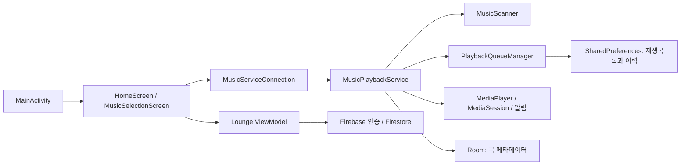

# LoopMuse 프로젝트 분석

## 프로젝트 성격

LoopMuse는 기기에 저장된 오디오 파일을 골라 재생하는 Android 앱입니다. Kotlin과 Jetpack Compose로 화면을 구성하고, `MusicPlaybackService`가 `MediaPlayer`와 전경 알림을 통해 재생을 담당합니다. 곡의 좋아요와 느낌·상황 태그는 로컬 Room 데이터베이스에 저장합니다. 별도 `Lounge` 화면은 Firebase의 익명 인증과 Firestore를 사용해 곡 추천 글을 공유합니다.

`README.md`의 AI 음악 추천은 출시 예정으로 쓰여 있으며 현재 소스에는 추천 모델이나 추천 요청 경로가 없습니다. 화면에 보이는 가사 영역도 작업 예정 표시입니다.

## 구조와 데이터 흐름

- `MainActivity`는 `HomeScreen` 하나를 띄웁니다. 홈은 재생 서비스에 바인딩하고 `StateFlow`로 현재곡, 재생 상태, 목록, 선택, 좋아요 등을 관찰합니다.
- 파일 선택 화면에서 폴더 또는 파일 경로를 `SelectionItem`으로 선택하면 서비스가 경로 목록을 저장하고 기존 큐를 초기화한 뒤 다시 스캔합니다.
- 스캐너는 `mp3`, `m4a`, `wav`, `flac`, `ogg` 파일을 찾습니다. 선택 항목이 비어 있으면 기기의 기본 Music과 Downloads 폴더를 스캔합니다. 폴더의 하위 폴더 포함 여부를 선택할 수 있습니다.
- 스캔 결과는 `PlaybackQueueManager`의 전체곡 큐와 사용자 목록의 곡 ID에 반영됩니다. 서비스는 큐의 현재 ID에 해당하는 파일을 `MediaPlayer`에 전달합니다.
- 재생목록과 재생 이력은 `playback_queue_v5` SharedPreferences에 저장됩니다. 선택한 파일·폴더 경로는 서비스의 `music_prefs`에 저장됩니다. 곡의 좋아요와 태그는 Room `song_metadata`에 저장됩니다. 다중 선택 상태는 실행 중 메모리 상태입니다.

## 실제 구현된 기능과 동작

| 기능 | 동작 경로와 규칙 |
| --- | --- |
| 오디오 범위 선택 | `MusicSelectionScreen`의 추천 폴더 또는 전체 폴더 탐색에서 파일·폴더를 체크합니다. 폴더는 하위 폴더 포함을 따로 지정합니다. 완료하면 서비스가 선택 경로를 저장하고 스캔합니다. |
| 재생목록 | `ALL`은 스캔된 전체곡입니다. 선택한 곡으로 사용자 목록을 만들거나 갱신할 수 있고, 검색 결과는 `TEMP` 임시 목록으로 표시합니다. 현재 목록은 콤보 메뉴에서 전환합니다. |
| 일반 재생 | 곡 행을 누르면 해당 ID로 큐의 현재 위치와 이력을 갱신하고 재생합니다. 재생/일시정지, 이전/다음곡, 탐색 슬라이더, 시스템 미디어 볼륨 슬라이더가 있습니다. MediaSession과 전경 알림에서도 일부 제어합니다. |
| 재생 순서 | 파일명·수정일·가수·앨범 기준을 오름차순/내림차순으로 정렬합니다. 랜덤은 큐 순서를 섞고, 스마트 모드는 이력에 있는 곡을 건너뜁니다. 한 곡 반복은 자동 다음곡에 가장 높은 우선순위를 적용합니다. |
| 다중 선택 | 선택 모드 버튼은 현재곡을 첫 선택으로 잡고 재생을 멈춥니다. 이후 곡 행을 누르면 재생 대신 선택을 토글하고, 선택곡은 파란 굵은 글씨로 표시합니다. 마지막 곡을 해제하거나 전체 해제하면 기존처럼 선택 모드를 종료합니다. 재생 버튼은 선택된 곡만 큐 순서대로 재생합니다. |
| 좋아요·태그 | 곡 행의 음표 아이콘은 좋아요를 Room에 저장합니다. 좋아요 필터는 현재 목록에서 좋아요 곡만 남깁니다. 곡 행의 연필 창에서 `태그 편집` 탭은 느낌과 상황 태그를 저장합니다. |
| 상세 검색 | 파일명·가수·앨범·전체 텍스트 검색에 좋아요와 느낌·상황 태그 조건을 조합합니다. 결과를 임시 재생목록으로 엽니다. 태그 그룹 안에서는 선택한 값 중 하나와 일치하면 되고, 그룹 사이 조건은 함께 만족해야 합니다. |
| 맛보기 | 맛보기 모드에서 곡을 시작하면 길이가 30초를 넘는 곡은 30초 지점부터 시작합니다. 재생 중 켜면 30초 이전일 때 그 위치로 이동하고, 50초 지점에 도달하면 다음 곡으로 넘어갑니다. |
| 재생 기록 초기화 | 현재 목록 초기화는 현재 목록의 이력과 순서 설정을 기본값으로 되돌립니다. 전체 초기화는 모든 목록의 재생 이력과 재생 옵션을 기본값으로 되돌립니다. |
| 데이터 백업·복원 | 사용자 지정 폴더의 `loopmuse_backup.json`에 Room 곡 메타데이터를 기록합니다. 복원은 `lastUpdated`가 더 최신인 항목을 채택하며 병합합니다. 재생목록과 알람은 이 JSON에 포함되지 않습니다. |
| 알람 | 홈에서 시간, 요일, 현재곡, 시작 위치, 목표 알람 볼륨, 점진적 볼륨 증가를 고릅니다. `AlarmManager`가 예약 시각에 `AlarmPlaybackService`를 시작하고, 곡 파일이 없으면 시스템 알람음을 사용합니다. 알림에서 알람을 끕니다. |
| Lounge | Firebase 익명 인증 후 Firestore 게시글을 실시간으로 봅니다. 짧은 글만 게시하거나 가수명·곡 제목을 함께 적어 YouTube 검색 링크를 붙일 수 있습니다. 곡 행의 연필 창에서 `곡 추천` 탭을 열면 곡 정보가 미리 채워집니다. 게시글 신고와 관리자용 삭제·사용자 차단 메뉴가 있습니다. |

## 재생과 선택의 상태 규칙

`PlaybackQueueManager`는 목록마다 `queue`, `currentIndex`, `history`, 정렬·랜덤·스마트·반복·좋아요 필터를 보관합니다. 다음곡은 **한 곡 반복 → 선택곡 재생 → 이전에 탐색한 이력 → 일반 큐의 순차/랜덤 규칙** 순으로 정합니다. 이전곡은 선택 재생 중이면 선택된 곡 사이에서 이동하고, 일반 재생 중이면 이력을 되짚습니다.

화면의 곡 행 클릭은 서비스가 현재 선택 모드를 확인한 시점에 재생 또는 선택으로 처리합니다. 선택곡은 기존의 파란 굵은 글씨로 표시합니다. 재생목록이나 검색 결과로 전환할 때 이전 목록의 다중 선택은 지웁니다. 파일·폴더를 다시 지정한 뒤 이전 스캔 결과가 늦게 도착해도 새 목록을 덮지 않도록 스캔 세대를 비교합니다.

## 구현 범위와 확인이 필요한 부분

- `MusicFile.fromFile`은 제목을 파일명으로, 가수·앨범을 `Unknown`으로, 길이를 `0`으로 초기화합니다. 따라서 가수·앨범 검색/정렬 및 알람 시작 위치 조절은 현재 스캔 정보만으로는 기대한 만큼 작동하지 않을 수 있습니다.
- 곡 ID는 파일 경로의 32비트 해시, 메타데이터 ID는 제목·가수·파일 크기의 32비트 해시입니다. 충돌이나 파일 경로 변경 시 선택/목록/메타데이터 연결에 영향을 줄 수 있습니다.
- 알람 화면의 반복 요일과 `AlarmEntity`/`AlarmDao`는 예약 경로에서 실제로 사용되지 않습니다. 예약은 단일 `AlarmManager` 호출이며 화면에서 만든 엔티티는 기본 ID `0`입니다.
- Lounge의 YouTube 버튼은 가수명·곡 제목 검색 결과를 엽니다. 특정 공식 영상이나 곡 재생을 보장하지 않습니다. 게시자 표시는 현재 익명이며 UID만 저장합니다. Firestore 배포 규칙은 이 저장소에서 관리하지 않으므로 운영 전 실제 읽기·쓰기·관리자 권한을 확인해야 합니다. 재생목록 삭제는 서비스 메서드만 있고 홈 화면에서 호출하지 않습니다. 재생목록 종료 이벤트도 화면에 표시하는 대화상자가 없습니다.
- 검색 임시 목록은 영구 저장되지 않지만 현재 목록 ID는 저장됩니다. 앱 재시작 시 마지막으로 보던 임시 목록을 복구하지 못할 수 있습니다.
- `PlaybackHistory`와 `PlaybackState` 타입은 현재 주 재생 경로에 연결되지 않습니다. 실제 재생 이력은 `PlaybackQueueManager`가 관리합니다.

## 신고된 선택 오류의 원인과 수정

재생목록 곡 행의 기존 `pointerInput(song.id)`는 첫 번째 누르기 또는 스크롤 취소를 처리한 뒤 입력 코루틴을 끝냈습니다. 같은 행이 화면에 남아 있으면 다음 누르기를 기다리지 않았고, 스크롤 등으로 행이 다시 만들어지면 다시 한 번 동작했습니다. 또한 입력 블록이 처음 구성될 때의 클릭 콜백을 잡고 있어 선택 모드 전환 뒤에도 일부 행은 이전 모드의 재생/선택 동작을 수행했습니다. 두 신고 증상이 같은 행 입력 경로에서 발생했습니다.

곡 행은 반복 클릭, 스크롤 취소, 자식 버튼과의 입력 처리, 접근성 활성화를 제공하는 Compose `clickable`로 변경했습니다. 서비스가 클릭 순간의 실제 선택 모드를 확인해 재생 또는 선택을 결정합니다. 체크박스 없이 기존의 파란 굵은 글씨와 눌림 배경을 사용합니다. 마지막 곡 또는 전체 선택을 해제하면 선택 모드가 종료되는 기존 동작도 유지했습니다. 선택 모드에서 선택 상태가 바뀔 때 자동 스크롤이 다른 행으로 이동하지 않도록 했습니다.

목록 전환·검색 후의 선택 잔존, 큐에서 사라진 곡의 선택 ID 잔존, 선택곡 재생 시작 시 큐 위치 불일치도 함께 정리했습니다. 이전곡의 빈 선택 목록 접근을 막고, 파일 선택을 빠르게 바꿀 때 오래된 스캔 결과가 새 결과를 덮지 않도록 했습니다. 서비스 재연결 시 이전 상태 구독도 취소합니다.

수정 후 `:app:compileDebugKotlin --offline` 컴파일은 성공했습니다. 실제 기기의 터치·오디오 동작은 이 작업 환경에서 재현하지 않았으므로, [사용자 확인 질문](USER_INTERACTION_QUESTIONS.md)의 첫 항목들을 기기에서 확인하면 좋습니다.

## 주요 소스 위치

| 영역 | 파일 |
| --- | --- |
| 화면과 입력 | `app/src/main/java/com/example/loopmuse/ui/HomeScreen.kt`, `ui/MusicSelectionScreen.kt` |
| 화면과 서비스 연결 | `service/MusicServiceConnection.kt` |
| 재생·검색·메타데이터 | `service/MusicPlaybackService.kt` |
| 목록·순서·이력·선택 | `service/PlaybackQueueManager.kt` |
| 파일 탐색·곡 모델 | `service/MusicScanner.kt`, `data/MusicFile.kt`, `data/SelectionItem.kt` |
| 로컬 저장 | `data/db/*`, `service/BackupManager.kt` |
| 알람 | `service/alarm/*` |
| 커뮤니티 | `community/ui/*`, `community/viewmodel/*`, `community/repository/*` |

추가 사용자 확인 항목은 [USER_INTERACTION_QUESTIONS.md](USER_INTERACTION_QUESTIONS.md)에 정리했습니다.
